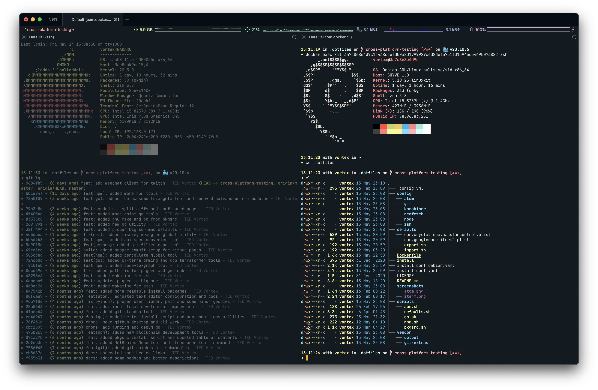
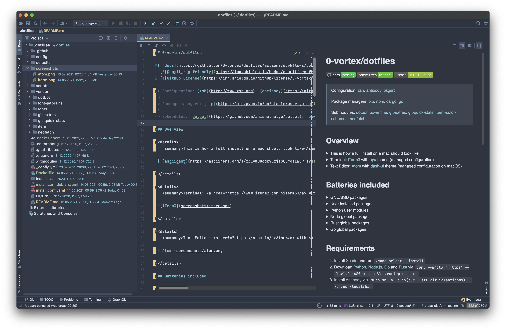

# 0-vortex/dotfiles   

[](https://github.com/0-vortex/dotfiles/actions/workflows/docs.yml)
 [](http://commitizen.github.io/cz-cli/)
 [](https://github.com/0-vortex/vortex.name/blob/master/LICENSE)

> Configuration: [zsh](http://www.zsh.org), [antibody](https://github.com/getantibody/antibody), [pkgsrc](https://www.pkgsrc.org)
> 
> Package managers: [pip](https://pip.pypa.io/en/stable/user_guide/), [npm](https://docs.npmjs.com/about-npm), [cargo](https://doc.rust-lang.org/cargo/), [go](https://github.com/golang/go/wiki/Modules)
>
> Submodules: [git-extras](https://github.com/tj/git-extras), [git-quick-stats](https://github.com/arzzen/git-quick-stats), [iterm-color-schemes](https://github.com/mbadolato/iTerm2-Color-Schemes)

## Overview

Just want to give it a spin in a sandbox?

```shell
docker run -dit --rm --name dotfiles 0vortex/dotfilesx:debian 
docker exec -it dotfiles zsh
```

<details>
  <summary>This is how a full install on a mac should look like</summary>

[](https://asciinema.org/a/414072)

</details>

<details>
  <summary>Terminal: <a href="https://www.iterm2.com">iTerm3</a> with <a href="https://raw.githubusercontent.com/mbadolato/iTerm2-Color-Schemes/master/schemes/ayu.itermcolors">ayu</a> theme (managed configuration on macOS)</summary>



</details>

<details>
  <summary>Text Editor: <a href="https://atom.io/beta">Atom beta</a> with <a href="https://github.com/cpsdqs/dash-ui">dash-ui</a> theme (managed plugins on macOS)</summary>


</details>

<details>
  <summary>Co-working: <a href="https://code.visualstudio.com/insiders/">VSC Insiders</a> with <a href="https://www.nordtheme.com">Nord</a> theme (unmanaged)</summary>


</details>

<details>
  <summary>IDE: <a href="https://www.jetbrains.com/webstorm/">WebStorm</a> with <a href="https://plugins.jetbrains.com/plugin/17418-foundation-theme">Foundation</a> theme (unmanaged)</summary>



</details>

## Batteries included

### User installed packages

- [powerline fonts](https://github.com/powerline/fonts)
- [JetBrains Mono font](https://github.com/JetBrains/JetBrainsMono)
- [git-extras](https://github.com/tj/git-extras)
- [neofetch](https://github.com/dylanaraps/neofetch)
- [ohmyzsh](https://github.com/ohmyzsh/ohmyzsh)
- [antibody](https://github.com/getantibody/antibody)

### GNU/BSD packages

- [bc-gh](https://cdn.netbsd.org/pub/pkgsrc/current/pkgsrc/math/bc-gh/index.html)
- [curl](https://cdn.netbsd.org/pub/pkgsrc/current/pkgsrc/www/curl/index.html)
- [gmake](https://cdn.netbsd.org/pub/pkgsrc/current/pkgsrc/devel/gmake/index.html)
- [gnuls](https://cdn.netbsd.org/pub/pkgsrc/current/pkgsrc/misc/gnuls/index.html)
- [gnupg](https://cdn.netbsd.org/pub/pkgsrc/current/pkgsrc/security/gnupg/index.html)
- [watchman](https://cdn.netbsd.org/pub/pkgsrc/current/pkgsrc/sysutils/watchman/index.html)
- [eza](https://crates.io/crates/eza)
- [fd-find](https://crates.io/crates/fd-find)
- [ripgrep](https://crates.io/crates/ripgrep)

### Python user modules

- [asciinema](https://github.com/asciinema/asciinema)
- [dnstwist](https://github.com/elceef/dnstwist)
- [git-fame](https://github.com/casperdcl/git-fame) - `git fame`
- [git-filter-repo](https://github.com/newren/git-filter-repo) - `git filter-repo`
- [httpie](https://github.com/httpie/httpie) - `http -v`
- [terraform-compliance](https://github.com/terraform-compliance/cli)
- [wafw00f](https://github.com/EnableSecurity/wafw00f)

### Node global packages

- [commitizen](https://www.npmjs.com/package/commitizen)
- [depcheck](https://www.npmjs.com/package/depcheck)
- [dree](https://www.npmjs.com/package/dree)
- [envinfo](https://www.npmjs.com/package/envinfo)
- [git-standup](https://www.npmjs.com/package/git-standup)
- [git-split-diffs](https://www.npmjs.com/package/git-split-diffs)
- [localtunnel](https://www.npmjs.com/package/localtunnel)
- [madge](https://www.npmjs.com/package/madge)
- [n](https://www.npmjs.com/package/n)
- [npm-check-updates](https://www.npmjs.com/package/npm-check-updates)
- [npkill](https://www.npmjs.com/package/npkill)
- [ntl](https://www.npmjs.com/package/ntl)
- [percollate](https://www.npmjs.com/package/percollate)
- [serve](https://www.npmjs.com/package/serve)
- [tldr](https://www.npmjs.com/package/tldr)

### Rust global packages

- [dotenv-linter](https://crates.io/crates/dotenv-linter)
- [hexyl](https://github.com/sharkdp/hexyl)
- [petname](https://github.com/allenap/rust-petname)

### Go global packages

- [croc](https://github.com/schollz/croc)
- [duf](https://github.com/muesli/duf)
- [glow](https://github.com/charmbracelet/glow)
- [httpx](https://github.com/projectdiscovery/httpx)
- [image2ascii](https://github.com/qeesung/image2ascii)

## Requirements

1. Install [Xcode](https://developer.apple.com/xcode/) or run ``xcode-select --install``
2. Download and install [Python](https://www.python.org)
3. Download and install [Node.js](https://nodejs.org/en/)
4. Download and install  [Go](https://golang.org/dl/) 
5. Download and install  [Rust](https://www.rust-lang.org/) via ``curl --proto '=https' --tlsv1.2 -sSf https://sh.rustup.rs | sh``
6. Install [Atom](http://atom.io) and ``CMD+SHIFT+P`` to ``Window: Install shell commands``
7. Optional, install [GPG Suite](https://gpgtools.org)
8. Optional, Install [KeyBase](https://keybase.io)

## Installation

Clone the package via git:

```shell
git clone git@github.com:0-vortex/dotfiles.git .dotfiles
cd .dotfiles
./install.sh
```

## How to use

Make appropriate `git` to the [config/git/.gitconfig](./config/git/.gitconfig) and [config/git/.gitignore_global](./config/git/.gitignore_global) files.

Change `npm` registry username in the [config/node/.npmrc-global](./config/node/.npmrc-global) file.

Enable or disable [macOS defaults](./defaults) folder.

### Set up GPG and commit signing

Copy over your `~/.ssh` folder.

Optionally import Keybase gpg key into gpg tools for signed commits (replace keyname with the returned key from list secret keys)

```shell
keybase pgp export --secret | gpg --allow-secret-key --import
gpg --list-secret-keys --keyid-format LONG
gpg --armor --export keyname | pbcopy
```

## Dockerize your fork

Assuming you are happy with your fork and just want to show it off, 
change the following to your `docker` username and just ship it. 

Here are manual examples of all the tags available in the current [Dockerfile](./Dockerfile.debian), testing included.

### Alpine

```shell
docker build -t 0vortex/dotfilesx:alpine -f Dockerfile.alpine --squash alpine .
docker run -dit --rm --name dotfiles-alpine 0vortex/dotfilesx:alpine
docker exec -it dotfiles-alpine zsh
```

### Arch

```shell
docker build -t 0vortex/dotfilesx:arch --squash arch .
docker run -dit --rm --name dotfiles-arch 0vortex/dotfilesx:arch
docker exec -it dotfiles-arch zsh
```

### Debian

```shell
docker build -t 0vortex/dotfilesx:debian --squash debian .
docker run -dit --rm --name dotfiles-debian 0vortex/dotfilesx:debian
docker exec -it dotfiles-debian zsh
```

### Fedora

```shell
docker build -t 0vortex/dotfilesx:fedora --squash fedora .
docker run -dit --rm --name dotfiles-fedora 0vortex/dotfilesx:fedora
docker exec -it dotfiles-fedora zsh
```

### Kali

```shell
docker build -t 0vortex/dotfilesx:kali --squash kali .
docker run -dit --rm --name dotfiles-kali 0vortex/dotfilesx:kali
docker exec -it dotfiles-kali zsh
```

### Ubuntu

```shell
docker build -t 0vortex/dotfilesx:ubuntu --squash ubuntu .
docker run -dit --rm --name dotfiles-ubuntu 0vortex/dotfilesx:ubuntu
docker exec -it dotfiles-ubuntu zsh
```
